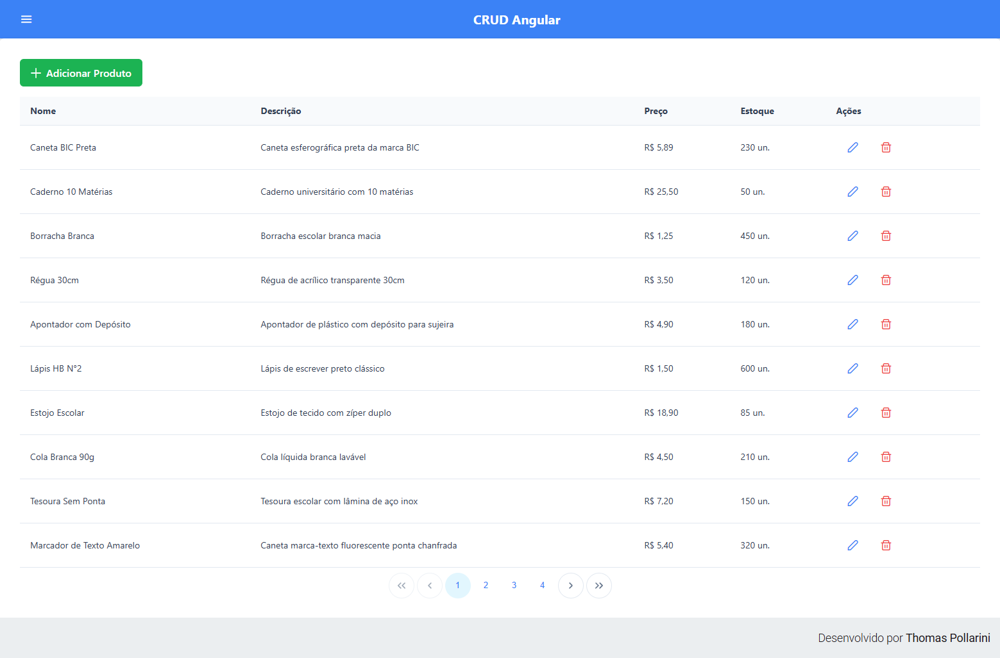
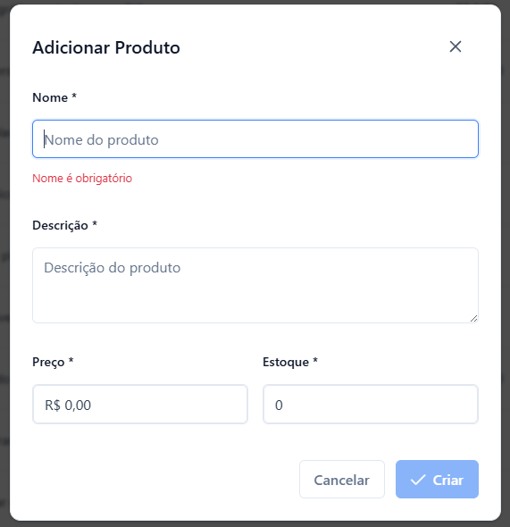
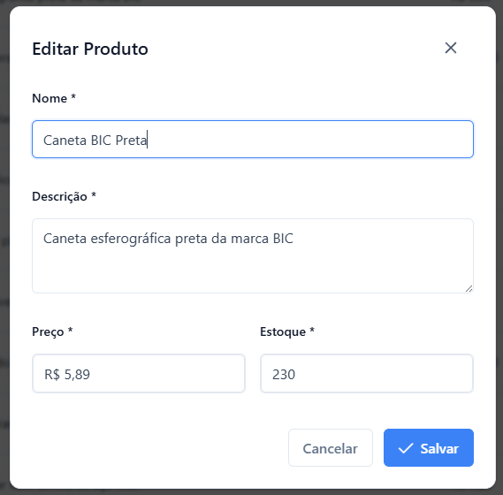
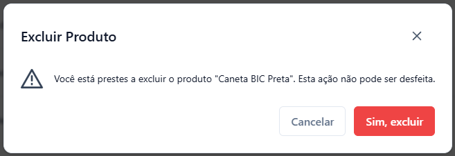

# CRUD-Angular

Projeto prático em Angular + JSON Server para gestão de produtos com operações CRUD.

## Preview

	

<table>
	<tr>
		<td width="33%">
			
		</td>
		<td width="33%">
			
		</td>
		<td width="33%">
			
		</td>
	</tr>
</table>

## 🧩 Visão Geral

Este repositório contém um exemplo de aplicação frontend em Angular e backend leve usando `json-server` para simular API REST.

- Frontend: Angular (TypeScript)
- Backend fake: json-server (`backend/db.json`)
- Funcionalidades: listagem, criação, edição e remoção de produtos

## 📁 Estrutura do Projeto

- `frontend/`
  - `src/app/` - componentes, serviços e modelos
  - `app/` - rotas, configuração e views
  - `public/` - arquivos estáticos
- `backend/`
  - `db.json` - dados iniciais da API simulada
  - `package.json` - dependências e scripts do servidor fake

## 🚀 Como executar localmente

1. Instalar dependências (Node.js instalado):
   - `cd backend && npm install`
   - `cd ../frontend && npm install`

2. Iniciar API falsa:
   - `cd backend`
   - `npm start`

3. Iniciar frontend Angular:
   - `cd frontend`
   - `npm start`

4. Acesse:
   - `http://localhost:4200` (Angular)
   - `http://localhost:3000/products` (API JSON Server)

## ⚙️ Funcionalidades

- Exibir lista de produtos
- Cadastrar novo produto
- Editar produto existente
- Excluir produto
- Trabalha com componentes e serviço de API no Angular

## 🛠️ Tecnologias

- Angular
- TypeScript
- HTML / CSS
- json-server (API fake)

## 🧪 Testes e manutenção

- Código pensado para aprendizado e protótipo
- Manter `db.json` como fonte simples de dados
- Extensões recomendadas:
  - Angular CLI
  - Prettier / ESLint (configurar conforme preferir)

## 📝 Melhorias futuras

- Criar API usando Spring Boot (Java) para substituir json-server

## 📌 Observações

Este projeto foi criado para demonstrar um fluxo CRUD clássico em Angular, ideal para estudo e reaproveitamento em projetos iniciais.
